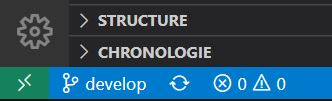

# Exercice 1 – Premier pas avec DevOps

### Informations
- Évaluation : formative
- Type de travail : individuel
- Durée : 1 heure
- Système d'exploitation : Votre choix

### Objectifs :

Dans cet exercice, vous allez vous installer un environnement de travail pour la majorité des exercices et des travaux pratiques du cours. Par la suite, vous allez travailler avec Git et les branches.

## Partie 1 : Installation et configuration
### Git
- S'il n'est pas installé, procéder à l'installation de git selon votre système d'exploitation. Vous pouvez-vous aidez du [site officiel](https://git-scm.com/). 

- Procédez aux [paramétrage](https://git-scm.com/book/fr/v2/D%C3%A9marrage-rapide-Param%C3%A9trage-%C3%A0-la-premi%C3%A8re-utilisation-de-Git)  de vos options globales en respectant les éléments suivant :
    - Le nom utilisé doit être celui inscrit dans LÉA.
    - Votre adresse de courriel doit être [matricule]@csfoy.ca.

### Installation Docker Desktop

 - Installez la dernière version de [Docker Desktop](https://www.docker.com/products/docker-desktop/)
 

## Installation Visual Studio Code

- Au besoin, installer [Visual Studio Code](https://code.visualstudio.com/)
- Installer les extensions suivantes :
    - Contrôle de code source 
    - Docker
    - Kubernetes

## Partie 2 : Premières commandes Git

Dans cette partie, vous allez cloner un dépôt Git, créer une branche et déposer cette branche sur le dépôt distant. Au prochain cours nous allons voir la théorie sûre comment travailler avec les branches.

- Clonez le dépôt git [git@github.com:jpduchesneauCegep/A_22_ITV_4393_Exercice1.git](git@github.com:jpduchesneauCegep/A_22_ITV_4393_Exercice1.git) à l'aide de VSCode.
- **Attentions, faites des commits à toutes les étapes avec des messages significatifs.**
- Ajouter une branche MaBranche_[VosInitiales]
pour ce faire cliquer sur la branche dans la bare en bas.

- Cliquez sur créer branche dans la barre du haut.
- Placez-vous sur cette branche, pour ce faire cliquer sur la branche dans la bare en bas.

- Prenez le fichier pageEtudiant.html et copier avec comme nouveau nom MaPage_[VosInitiales] 
            et placer ce fichier dans le dossier étudiants.

- Créer un lien hypertext entre votre page et votre nom dans la liste de la page index.html.
- Faite un commit.
- Pousser votre branche sur le dépôt distant.
- Vous pouvez le faire avec Visual Studio Code.
- Allez sur le dépôt sur Git Hub et vérifiez si votre travail est présent dans les branches suivantes : 

|Nom de la Branche | Est-il présent |
--- | --- 
|Main| oui non |
|Develop|oui non|
|Votre branche |oui non|

- Expliquer ce résultat. Nous allons en discutter au prochain cours.

Faite une requête de tirage (pull request) pour fusionner votre branch avec develop
## Pour vérification
Fait une capture de requête de tirage sur Git Hub et mettre celle-ci comme preuve de réalisation de votre exercice.

