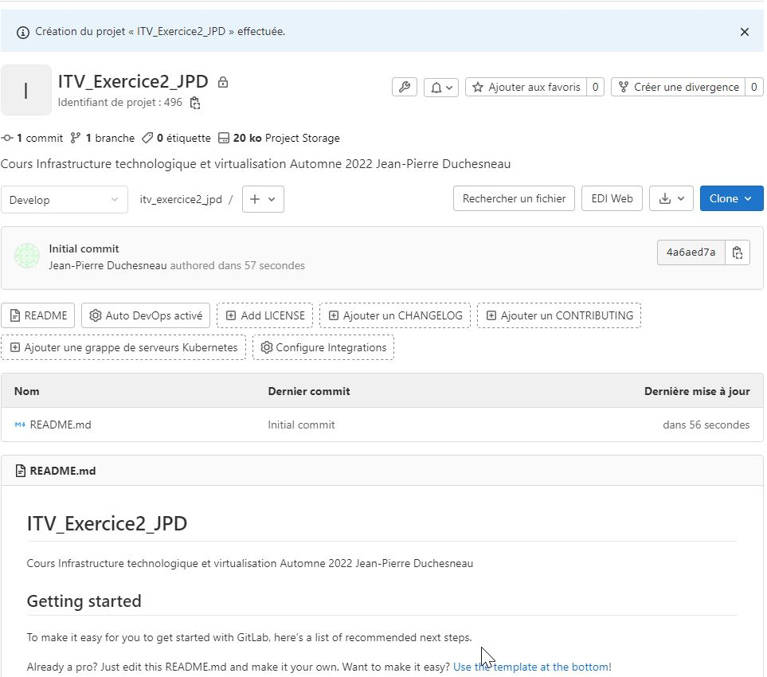
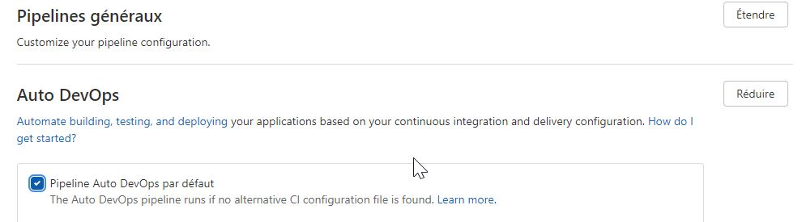
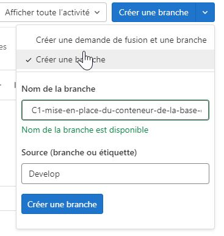
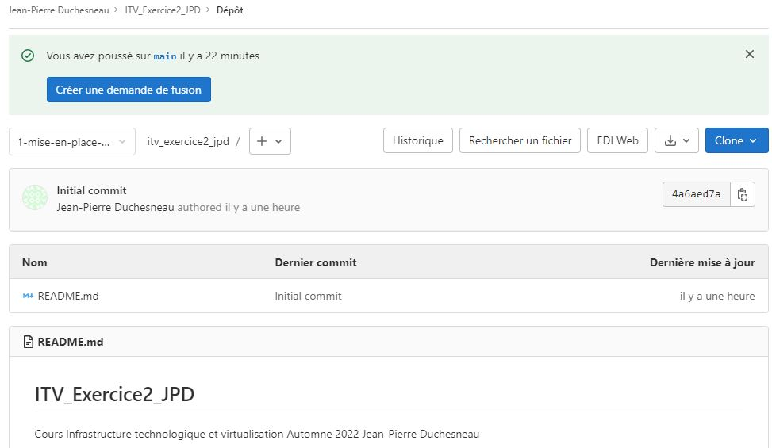
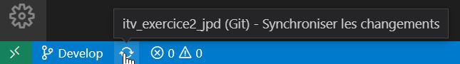
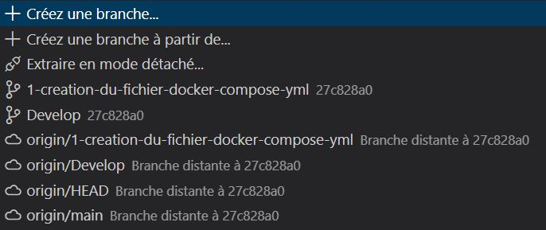

# Exercice 2 – Utilisation des branches git

### Informations
- Évaluation : formative
- Type de travail : Individuel
- Durée : 2 heures
- Plate forme : Git Lab DFC.

### Objectifs :

Dans cet exercice, vous allez développer des tâches liées à des branches d'un dépôt. Vous allez apprendre à créer les branches, à les fusionner et au besoin à régler les conflits. Pour réaliser cet exercice, vous allez prendre le code de votre TP2 du cours Installation de serveurs et de services (Mise en place d’un service Web).

## Préalable 

 Si ce n'est pas déjà fait, configurer votre compte GitLab : 
   
  - Pour ce faire, cliquez sur la dernière icône en haut à droite -> Préférence.
  - Sélectionnez Clés SSH et insérez votre clé publique.
  - Vous pouvez en profiter pour vérifier les différentes options de paramétrage de l'utilisateur.

## Partie 1 : Création d'un projet Git Lab

- Dans  [GitLab](https://dfcgit.cegep-ste-foy.qc.ca) créer un projet git à la racine de votre usager
    
    - Nommez votre projet : ITV_Exercice2_[Initials];
    - URL du projet sélectionnez votre identifiant dans la liste déroulante.
    - Ajouter une description résumant le projet;
    - Choisissez la visibilité privée;
    
    - Dans mon cas ça donnez ceci :  https://dfcgit.cegep-ste-foy.qc.ca/jpduchesneau/itv_exercice2_jpd

    

    - Prenez quelques minutes pour lire les informations de bases de votre projet. 
    
    - Essayer de comprendre l'ensemble des boutons disponible. Au besoin, référez-vous à l'aide : https://dfcgit.cegep-ste-foy.qc.ca/help
    - Lisez la liste des étapes proposées dans la section "Getting started".
    - À partir de la section "Invite team members and collaborators" invité le professeur (@jpduchesneau) à collaborer à votre projet comme membre direct entant que Maintainer sans date d'expiration.


## Configuration du projet

 - Désactivez le pipeline Auto DevOPS :

     - Allez dans -> Paramètres -> Intégration et livraison continues -> Auto DevOps, cliquez sur Étendre et désactiver Pipeline Auto DeOps par défaut.
        

- Créez la branche main :

    - Allez dans Dépôt -> Branches et cliquez sur Nouvelle Branche en haut à droite.
    - Nommez la nouvelle branche **main**. Create from Develop.

- Vérifiez si la branche develop est la branche par défaut : 
  
     - Allez dans -> Paramètres -> Dépôt -> Default branch, vérifiez l'état de la branche Au besoin modifier pour qu'elle soit la branche par défaut.
        

- Protégez la branche main : 
     - Allez dans -> Paramètres -> Dépôt -> Proteted branches.
     - Sélectionnez la branche main dans Protect a branche.
     - Sélectionnez dans Allowed to merge (Autorisé à fusionner) : Mainteners
     - Sélectionnez dans Allowed to push : Developers + Maintainers.

## Clone du projet dans Visual Studio Code

- Allez dans VS Code et faite un clone de votre nouveau projet.

## Création des tickets

- Retournez sur votre projet dans GitLab.
- Dans le menu de gauche (ou en haut à gauche de recherche cliquez sur le + et Nouveau ticket)-> Liste -> Nouveau ticket.
- Pour chacune des tâches suivantes, créer un ticket :
    - Création du fichier docker-compose.yml
    - Mise en place du conteneur de la base de données.
    - Création d'un fichier dockerfile pour php.
    - Modification des fichiers de configuration des serveurs 1 et 2.
    - Modification du default.conf de nginx.
    - Autre ticket au besoin.
  - Remplir les champs suivants pour chaque ticket :
    - Title
    - Type (Issue)
    - Description
    - Assignez-vous le ticket
    - Créer ticket

## Création des branches depuis les tickets

- Pour chaque ticket fait ce qui suit en ordre de création des ticket : 
    - Ouvrir le ticket 
    - Cliquez sur Créer une demande de fusion pour l'ouvrir et sélectionnez Créer une branche.

        
    
    - Cliquez à nouveau sur Créer une branche.
    - Vous devez maintenant être sur votre nouvelle branche :

     

     - Allez dans VS Code.

     - Cliquez sur synchroniser les changements en bas à droite du mot Develop.

     

     - Vérifier si la nouvelle branche est présente.

    - Elle ne devrait pas puisque nous n'avonps pas encore fait de fetch.

    - Ouvrez un terminal dans VS code et vous devriez être dans votre dépôt, si non, déplacer vous à l'intérieure de celui-ci.

    - Taper les commandes suivantes : 

    ```pw
    git status
    git remote -v
    git fetch
     ```
    - Vérifier si la nouvelle branche est présente. Vous devriez la voir dans la liste du haut entant que branche remote (origin-1...).

    - Sélectionnez cette branche. Vérifier qu'elle est maintenant présence en local.

        

     - Rédiger le code de votre branche. Dans le cas qui m'intéresse, je place le fichier Docker-Compose de mon Tp2.

     - Quand vous avez terminé le travail de la première tâche, faite les commandes suivantes dans VS code :
        - git add 
        - git commit 
        - git push
    - Allez sur GitLab et placez-vous sur la branche
    - vérifier que la branche et son contenu sont ok.
    - Si non retourné dans VS Code pour corriger.
    - Si oui, procéder à la demande de fusion de la branche dans votre branche develop.
    - Approuvez la demande de fusion.
    - À l'étape Ready to merge, cliqué sur Merge. 
    
    - Vérifier les points suivants après un Merge :
        - Est-ce que la branche a été supprimée ?
        - Est-ce que son contenu est placé dans develop ?
        - Regarder où est le ticket no 1.
        


- Prenez le ticket suivant et refaites tous ce qui est nécessaire dans la partie précédente. Pour finaliser votre exercice 2.


## Pour vérification
Allez dans Dépôt -> Graphique et fait une capture du graphique de la branche develop et mettre celle-ci comme preuve de réalisation de votre exercice.


